# Nitrax Math Keyboard for macOS

Official distribution and user documentation for the Nitrax Math Keyboard companion app on macOS 15 or later.

Release **v1.0.0** · App version **1.0 (16)** · Universal **Apple silicon and Intel** application

[Download the latest DMG](https://github.com/NitraxMathematicalKeyboard/nitrax-math-keyboard-macos/releases/latest/download/Nitrax-Math-Keyboard.dmg) · [View the latest release](https://github.com/NitraxMathematicalKeyboard/nitrax-math-keyboard-macos/releases/latest) · [Quick Start](https://mathematicalkeyboard.com/how-to-use-the-nitrax-math-keyboard-macos/) · [Full documentation](https://mathematicalkeyboard.com/full-documentation-macos/)

The physical keyboard works as a normal keyboard as soon as it is connected. The macOS app enables the printed blue and gray math-symbol layers, guides you through the required Mac settings, and provides day-to-day controls in the menu bar.

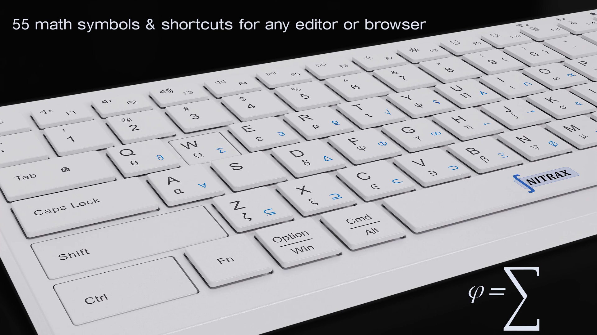

## Contents

- [Requirements](#requirements)
- [Connect the keyboard](#connect-the-keyboard)
- [Download and install Nitrax](#download-and-install-nitrax)
- [Complete guided setup](#complete-guided-setup)
- [Type math symbols](#type-math-symbols)
- [Use the menu bar app](#use-the-menu-bar-app)
- [Updates and recovery](#updates-and-recovery)
- [Troubleshooting](#troubleshooting)
- [Uninstall selectively](#uninstall-selectively)
- [Compatibility, privacy, and trust](#compatibility-privacy-and-trust)
- [Support](#support)
- [About this repository](#about-this-repository)

## Requirements

- macOS **15.0 or later**.
- A Nitrax Math Keyboard, switched on and connected by either the included 2.4G USB receiver or Bluetooth.
- An internet connection during initial setup so Nitrax can obtain the official Karabiner-Elements installer.
- An administrator account or administrator password for Apple’s Installer.
- Permission to change the specific items that the setup guide opens in System Settings.

The current app supports the official **Karabiner-Elements 16.1.0** baseline. Let Nitrax verify and open that installer during onboarding.

## Connect the keyboard

Choose one wireless connection at a time.

### 2.4G USB receiver

1. Remove the receiver from its storage slot underneath the keyboard.
2. Connect it to the Mac. Use a USB adapter if the Mac has no matching port.
3. Switch on the keyboard.
4. Press the **2.4G** key once. The 2.4G indicator should light.

If it does not reconnect, hold the 2.4G key for about three seconds until its indicator flashes rapidly, then try again.

### Bluetooth

1. Switch on the keyboard and press the Bluetooth key once.
2. Hold the Bluetooth key for about three seconds, until its indicator flashes rapidly.
3. On the Mac, open **System Settings → Bluetooth**.
4. Find **IOP582**, **IOP583**, or **IOP584**, then choose **Connect**.

If a previously paired keyboard will not reconnect, remove that device from Bluetooth settings and repeat the pairing steps.

## Download and install Nitrax

> **Download:** [Nitrax-Math-Keyboard.dmg](https://github.com/NitraxMathematicalKeyboard/nitrax-math-keyboard-macos/releases/latest/download/Nitrax-Math-Keyboard.dmg)
>
> **Release page:** [latest Nitrax macOS release](https://github.com/NitraxMathematicalKeyboard/nitrax-math-keyboard-macos/releases/latest)

1. Download the DMG from either official link above or from the [macOS Quick Start](https://mathematicalkeyboard.com/how-to-use-the-nitrax-math-keyboard-macos/).
2. Wait for the download to finish, then open `Nitrax-Math-Keyboard.dmg`.
3. In the disk-image window, drag **Nitrax Math Keyboard** onto **Applications**.
4. Open **Nitrax Math Keyboard** from the Applications folder.
5. If macOS shows its standard first-open security message, confirm that you want to open the app.

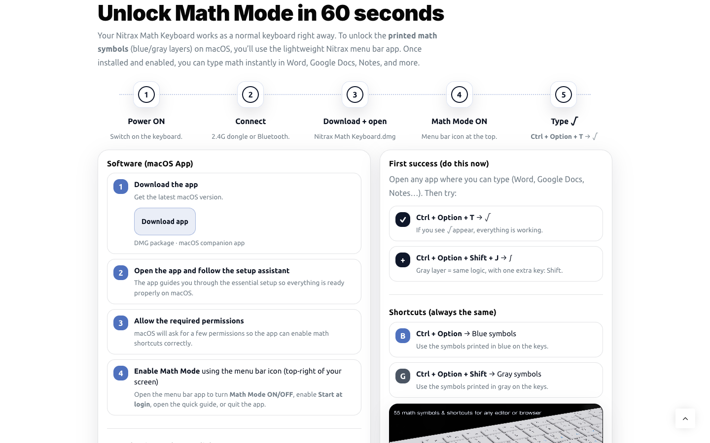

_Download the app from the official Quick Start or the release links in this README._

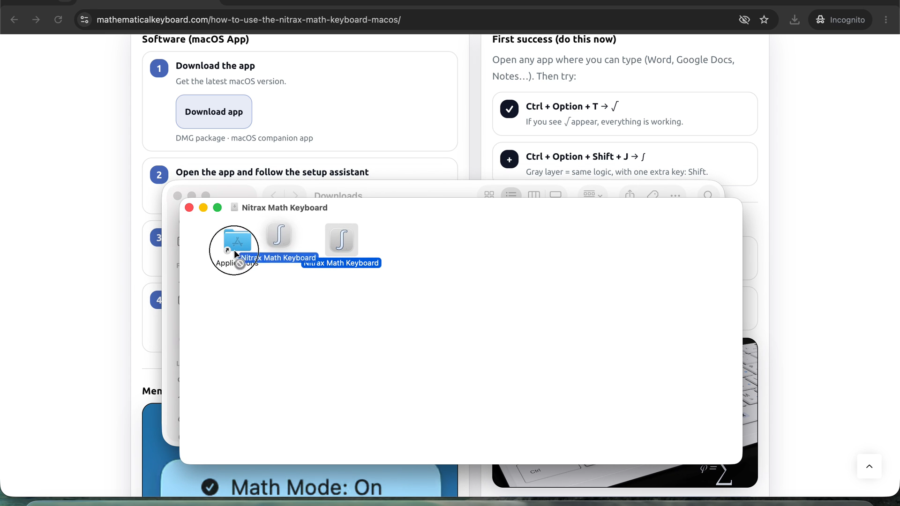

_Install the app by dragging it to Applications._

### Verify the download, if desired

The SHA-256 of the current `v1.0.0` DMG is:

```text
c889f055c458e1fe54cddd805cecacff0ee94e992d83b96fe48415d8c337dfcd
```

In Terminal, you can compare it with:

```sh
shasum -a 256 ~/Downloads/Nitrax-Math-Keyboard.dmg
```

Do not continue if the value differs. Delete that copy and download the DMG again from the official release.

## Complete guided setup

Nitrax checks that it is running from Applications and then walks through the rest of setup. Return to Nitrax after each external window; the guide normally detects the completed step automatically.

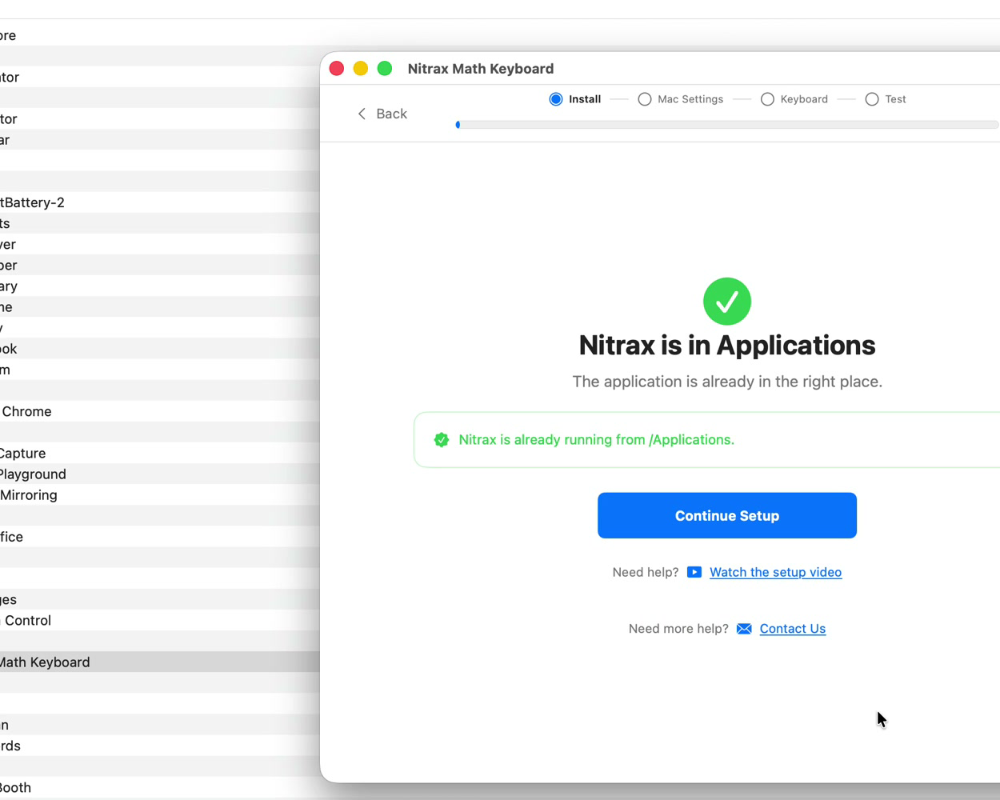

_The Applications check prevents a temporary download copy from becoming the daily app._

### 1. Install Karabiner-Elements

[Karabiner-Elements](https://karabiner-elements.pqrs.org/) is a separate macOS keyboard-customization utility. Nitrax uses it so the printed symbol shortcuts work reliably across apps.

Nitrax downloads the official installer, verifies it, and opens the unchanged package in Apple’s Installer. Nitrax never sees the Mac password entered into Installer.

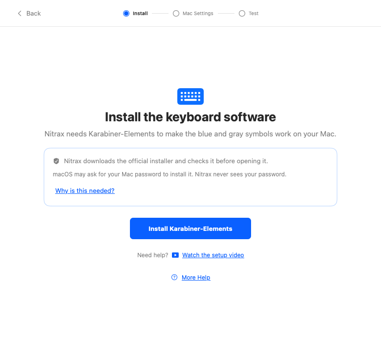

1. In Nitrax, choose **Install Karabiner-Elements**.
2. In Apple’s Installer, choose **Continue**, then **Install**.
3. If macOS asks, choose **Use Password**, enter the Mac administrator password, and approve the installation.

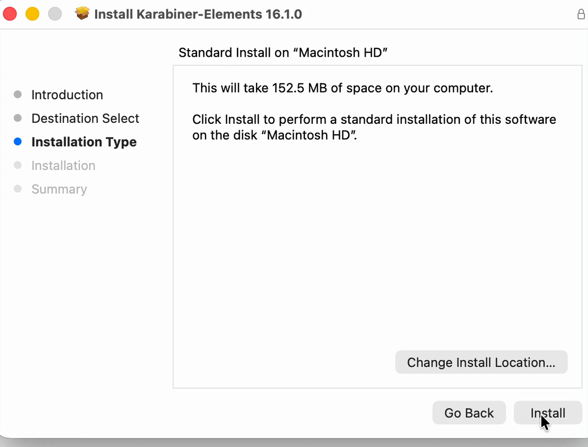

### 2. Allow the background services

Open **System Settings → General → Login Items & Extensions** and turn on both Karabiner-Elements background items. The entries may appear under the developer name **Fumihiko Takayama**; that is expected.

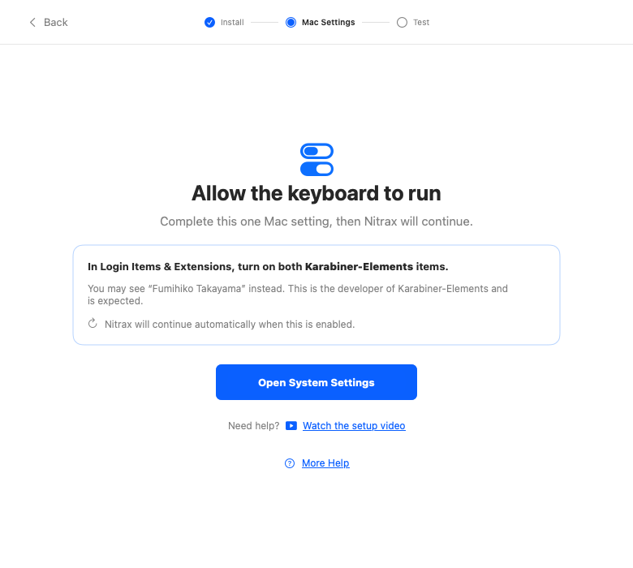

### 3. Allow Karabiner Accessibility

If Nitrax asks for this permission:

1. Open **System Settings → Privacy & Security → Accessibility**.
2. Turn on **Karabiner-Core-Service**.
3. Return to Nitrax and wait for setup to continue.

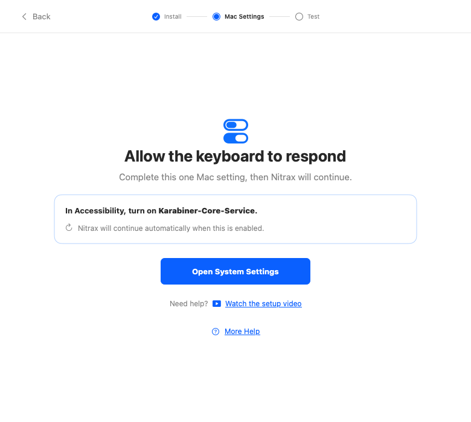

_This is an exact Nitrax setup screen, not a screenshot of System Settings._

### 4. Allow Input Monitoring only if requested

Input Monitoring is conditional. If the setup advances without asking for it, do not add it manually.

If Nitrax still requests it after Karabiner Accessibility is enabled:

1. Open **System Settings → Privacy & Security → Input Monitoring**.
2. Turn on **Karabiner-Core-Service**.
3. Return to Nitrax.

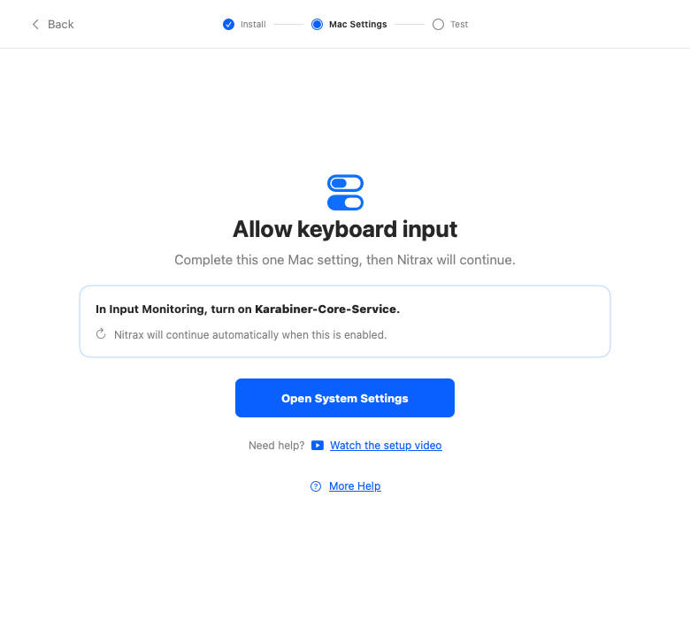

_This is an exact Nitrax setup screen, not a screenshot of System Settings._

### 5. Allow the Driver Extension

In **System Settings → General → Login Items & Extensions**:

1. Open the details next to **.Karabiner-VirtualHIDDevice-Manager**.
2. Turn on **Driver Extension**.
3. Choose **Done**.
4. Restart the Mac only if macOS explicitly asks.

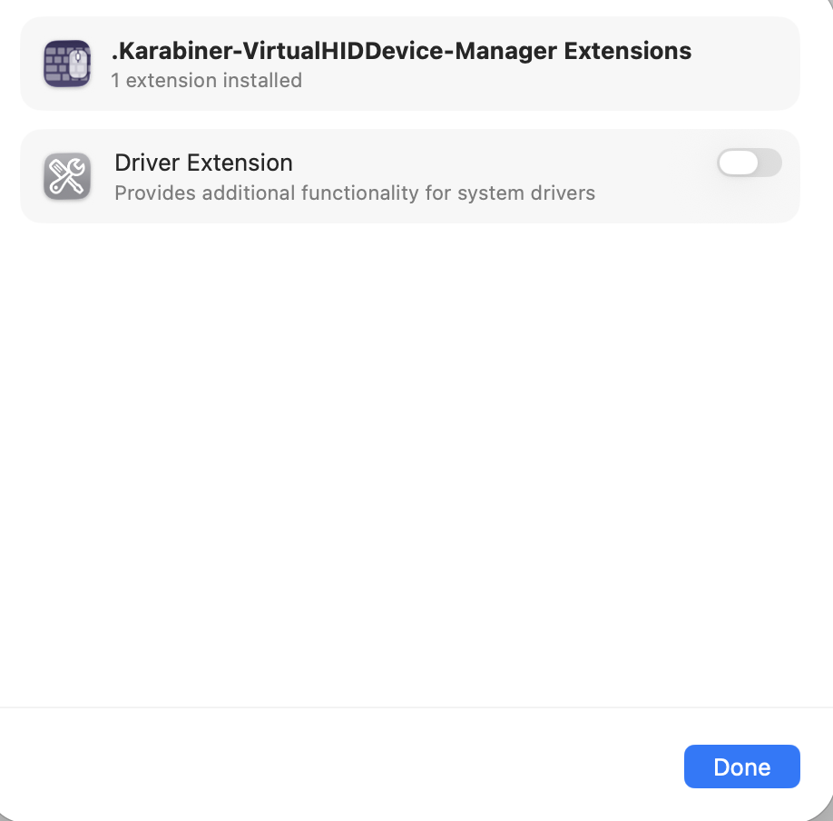

### 6. Choose ANSI when Karabiner asks

Choose **ANSI** for the Nitrax keyboard shown here. Nitrax then adds its three rules while preserving unrelated Karabiner rules and their order.

If an existing profile uses ISO or JIS, read the warning before changing the profile-wide virtual keyboard type because the choice may affect other Karabiner rules.

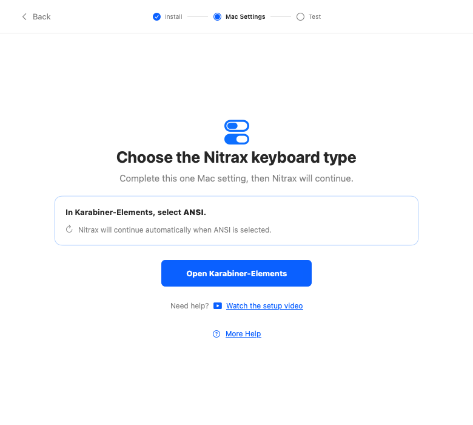

### 7. Allow Nitrax Accessibility

This permission lets the Nitrax app type symbols in other applications. It is separate from the Karabiner permission.

1. Open **System Settings → Privacy & Security → Accessibility**.
2. Turn on **Nitrax Math Keyboard** — not Karabiner-Core-Service.
3. Return to Nitrax and wait for setup to continue.


_This is an exact Nitrax setup screen, not a screenshot of System Settings._

### 8. Let Nitrax finish configuration

Nitrax adds the Gray layer, Blue layer, and Browser Compatibility rules. Existing non-Nitrax Karabiner settings remain in place.

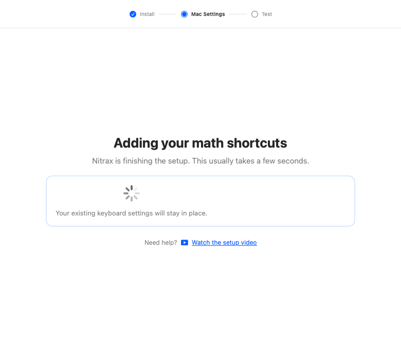

### 9. Select Mac mode and run both tests

1. Confirm that the keyboard is on and connected.
2. Press **Fn + W** once to select Mac mode.
3. Use the **left Control** and **left Option** modifiers for the tests.
4. Type **Control + Option + T**. The result should be **√**.
5. Type **Control + Option + Shift + J**. The result should be **∫**.
6. When both tests pass, choose **Start Using Nitrax**.

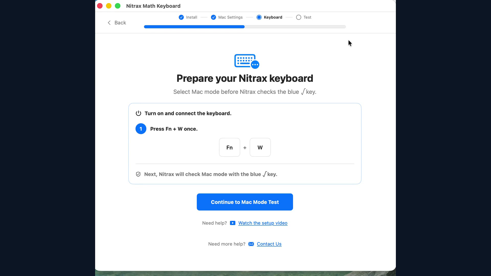

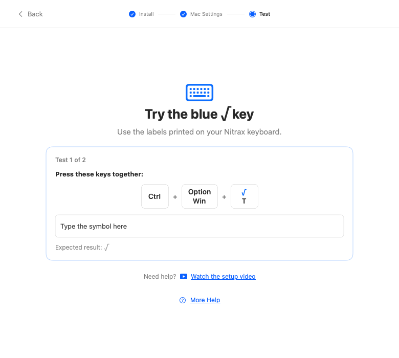

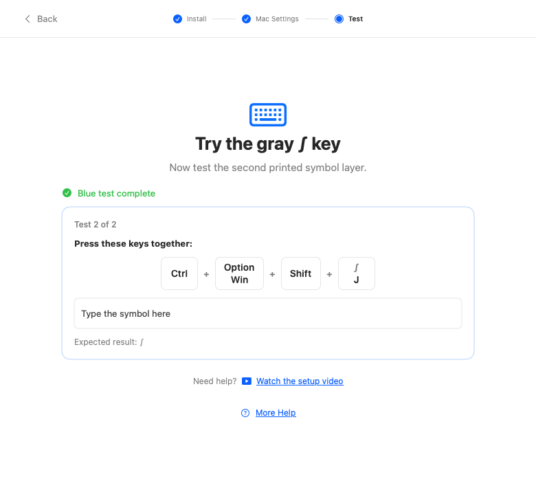

## Type math symbols

Keep **Math Mode: On**, then use the labels printed on the physical keys:

| Printed layer | macOS shortcut | Example |
|---|---|---|
| Blue | left **Control + Option + key** | **Control + Option + T → √** |
| Gray | left **Control + Option + Shift + key** | **Control + Option + Shift + J → ∫** |

The output is a Unicode text character, not an image. It can be inserted into Notes, documents, messages, presentations, and many other text fields. For structured fractions, matrices, alignment, or full equation layout, continue to use an equation editor or typesetting tool.

Test in **Notes** first. If both examples work there, the Nitrax setup is normally healthy. A browser or web app can reserve a shortcut, transform text, or behave differently in a particular field; a failure limited to one site is usually app-specific rather than a global setup failure.

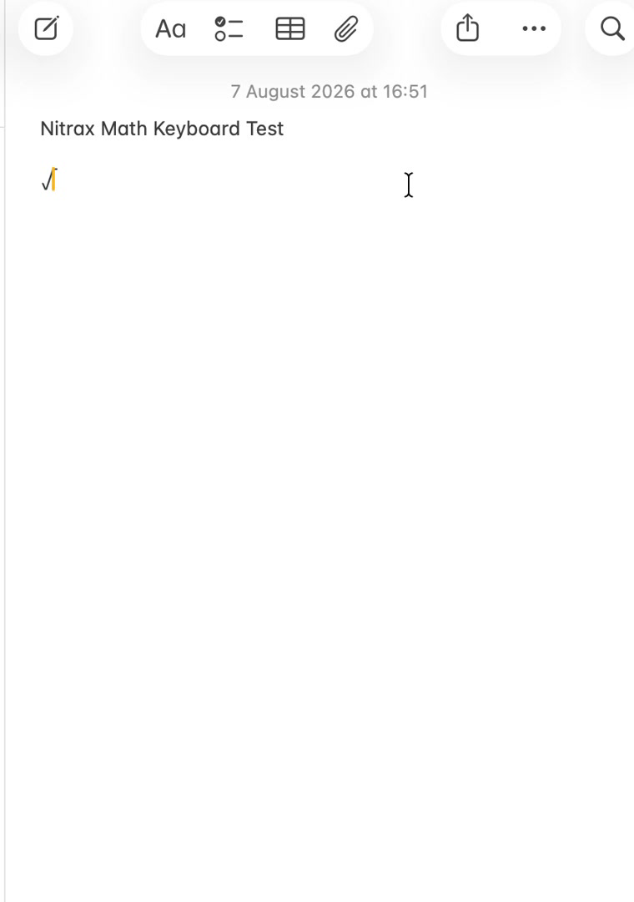

## Use the menu bar app

Click the Nitrax icon in the macOS menu bar for daily controls.

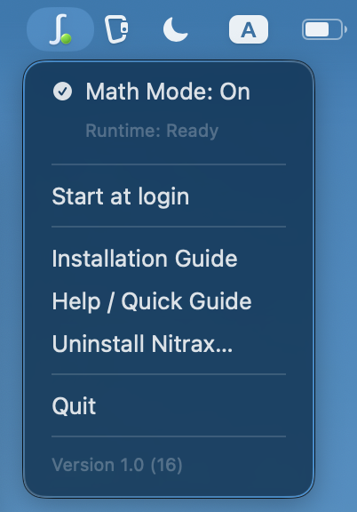

- **Math Mode: On / Off** — On enables the printed symbol layers. Off restores the ordinary shortcuts without quitting the app.
- **Runtime** — `Ready` means the helper and permissions are available. `Starting`, `Accessibility Required`, `Browser Compatibility Reconnecting`, `Needs Attention`, or `Not Ready` identifies the area that still needs attention.
- **Start at login** — opens Nitrax automatically after sign-in. macOS may ask you to approve the login item in System Settings.
- **Installation Guide** — reopens guided setup without requiring a reinstall.
- **Help / Quick Guide** — opens the official written macOS Quick Start.
- **Uninstall Nitrax…** — opens the selective removal guide described below.
- **Quit** — closes Nitrax and its owned helper. Symbol shortcuts are unavailable until Nitrax is launched again.
- **Version 1.0 (16)** — identifies the installed public release.

## Updates and recovery

### Install a newer Nitrax release

1. Download the new DMG from the [latest release](https://github.com/NitraxMathematicalKeyboard/nitrax-math-keyboard-macos/releases/latest).
2. Open the new Nitrax copy.
3. When **Update Nitrax in Applications** appears, choose **Install Update**.
4. Wait for the verified Applications copy to open.

Nitrax keeps the current installed copy until the update opens successfully. An older download is not allowed to replace a newer installed version.

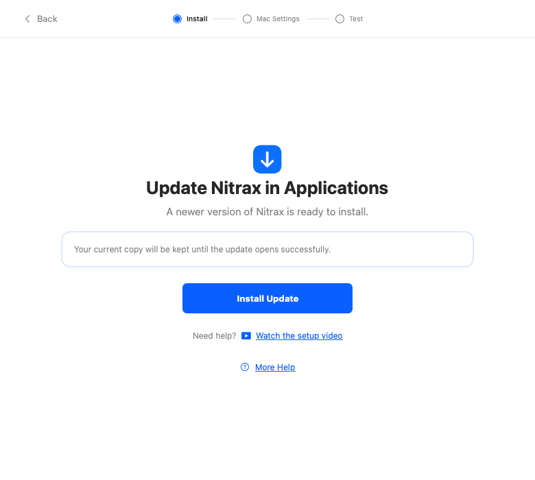

### Understand recovery states

Nitrax uses specific recovery messages rather than continuing after an uncertain installation or configuration change. Follow the action shown on screen. Depending on the issue, the previous application is kept or restored, a partial configuration is rolled back, or the user is asked to retry a verified step.

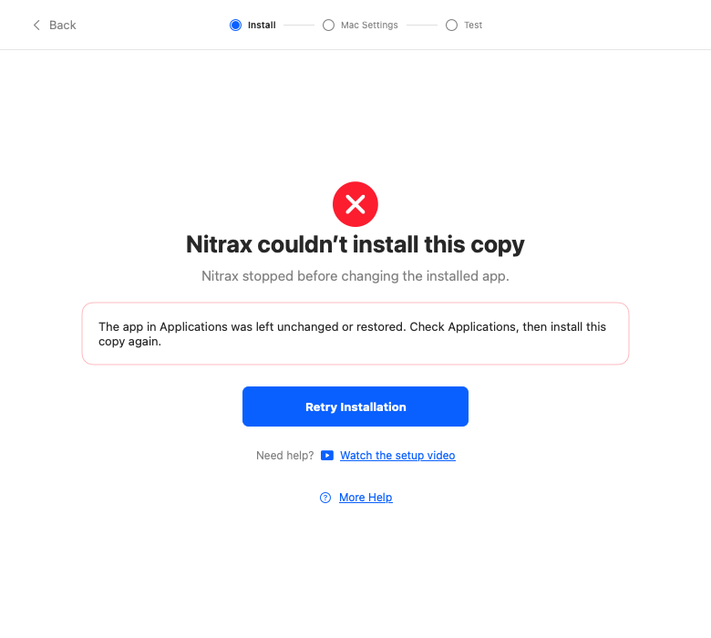

If a recovery screen persists:

1. Read the message before retrying.
2. Confirm that Nitrax is in Applications and that there is no unrelated app with the same name.
3. Reopen **Installation Guide** and resume the incomplete step.
4. Use [Contact support](#support) before manually deleting Karabiner files or changing advanced settings.

## Troubleshooting

### Nothing happens when a symbol shortcut is pressed

- Confirm that Nitrax is running and its menu-bar icon is visible.
- Set **Math Mode: On**.
- Check that **Runtime: Ready** appears.
- Press **Fn + W** once, then retry with the left Control and Option keys.
- Test `Control + Option + T` in Notes.
- Reopen **Installation Guide** if a permission or setup step is incomplete.

### Shortcuts work in Notes but not in one app or browser

The target application may intercept that shortcut or handle text insertion differently. Try another normal text field, then check the [full compatibility guidance](https://mathematicalkeyboard.com/full-documentation-macos/). Writing apps are a better baseline than spreadsheets or specialized editors.

### Runtime is not Ready

- **Starting** — wait a few seconds.
- **Accessibility Required** — enable **Nitrax Math Keyboard** in Accessibility.
- **Browser Compatibility Reconnecting** — keep Nitrax running briefly while its browser rule reconnects.
- **Needs Attention / Not Ready** — reopen **Installation Guide** and complete the first reported step.

### Bluetooth does not pair or reconnect

- Confirm that the Bluetooth indicator is flashing rapidly, not merely lit.
- Hold the Bluetooth key for about three seconds to enter pairing mode.
- Look for IOP582, IOP583, or IOP584 in System Settings.
- If the keyboard was paired before, remove it from Bluetooth settings and pair again.
- Confirm that the keyboard is not currently using 2.4G mode.

### The 2.4G connection does not work

- Confirm that the receiver is fully inserted or that the USB adapter works.
- Press the 2.4G key once.
- If necessary, hold it for about three seconds until the indicator flashes rapidly.
- Avoid pairing Bluetooth at the same time; the keyboard uses one connection mode at a time.

### Karabiner setup does not advance

- Confirm that Karabiner-Elements **16.1.0** completed installation.
- Enable both background items.
- Enable **Karabiner-Core-Service** in Accessibility.
- Enable Input Monitoring only if Nitrax explicitly requests it.
- Enable the Karabiner Driver Extension and choose ANSI when asked.
- Return to Nitrax after each change and allow a moment for automatic detection.

Do not delete `~/.config/karabiner`, rewrite `karabiner.json`, or remove unrelated rules as a troubleshooting shortcut.

### A permission is already enabled, but Nitrax still asks for it

Turn only the exact requested entry off and on if support instructs you to do so. Otherwise, quit Nitrax, reopen it from Applications, and use **Installation Guide**. Make sure you are changing **Karabiner-Core-Service** for the Karabiner step and **Nitrax Math Keyboard** for the Nitrax step.

## Uninstall selectively

Use the in-app guide so Nitrax can remove only the state it owns.

1. Open the Nitrax menu and choose **Uninstall Nitrax…**.
2. Choose whether to archive the versioned Nitrax mapping asset.
3. Choose whether to remove the enabled Nitrax rules.
4. If selected, use Karabiner’s normal **Complex Modifications** interface to remove only:
    - `Math Keyboard - Gray layer`
    - `Math Keyboard - Blue layer`
    - `Browser Compatibility - Math Mode`
5. Choose **Show App in Finder**, then **Quit Nitrax**.
6. Move only the revealed **Nitrax Math Keyboard** app to the Trash.

The guide removes the Nitrax login item, stops the helper when Nitrax quits, and restores Karabiner’s prior update-checking preference only when the Nitrax-owned value is still unchanged. Cancelling before the final Quit restores the prepared Nitrax state.

Karabiner-Elements is a separate application. Keep it if you use it for other customizations. If you decide to remove it too, use Karabiner’s own official uninstaller; do not delete its configuration directory manually.

## Compatibility, privacy, and trust

| Item | Current release |
|---|---|
| GitHub release | `v1.0.0` |
| App version | `1.0 (16)` |
| Minimum macOS | `15.0` |
| Architectures | Universal Mach-O: `arm64` and `x86_64` |
| Karabiner baseline | Official `16.1.0` |
| Signing | Developer ID Application |
| Team ID | `789UX97R6X` |
| Apple trust | App and DMG notarized; tickets stapled |
| DMG SHA-256 | `c889f055c458e1fe54cddd805cecacff0ee94e992d83b96fe48415d8c337dfcd` |

Nitrax runs locally and contains no telemetry. Keyboard processing stays on the Mac; typed text is not transmitted. The app uses the permissions described above only to provide global symbol insertion and the required keyboard behavior.

Nitrax-managed Karabiner changes are narrow: the three Nitrax rules are added without removing foreign rules or changing their order, and selective uninstall does not delete unrelated assets, profiles, rules, or global settings.

The public application and helper are signed with **Developer ID Application: Michel Dubois (789UX97R6X)**. The distributed app and DMG were accepted by Apple notarization and include stapled tickets for offline validation.

## Support

Before contacting support, include:

- the macOS version;
- Nitrax version `1.0 (16)` or the version shown in the menu;
- whether the connection is Bluetooth or 2.4G;
- the Runtime status shown in the Nitrax menu;
- the exact setup step or application where the problem appears;
- whether both test shortcuts work in Notes.

Support options:

- [Official macOS Quick Start](https://mathematicalkeyboard.com/how-to-use-the-nitrax-math-keyboard-macos/)
- [Full macOS documentation](https://mathematicalkeyboard.com/full-documentation-macos/)
- [Contact form](https://mathematicalkeyboard.com/#contact)
- Email: [contact@mathematicalkeyboard.com](mailto:contact@mathematicalkeyboard.com)

## About this repository

This repository contains only the official macOS distribution entry point and public user documentation for Nitrax Math Keyboard.

The product source code is maintained privately and is not published here. This repository intentionally contains no Swift or Python source, internal manifests, signing evidence, QA reports, credentials, private media, or machine-specific paths.
